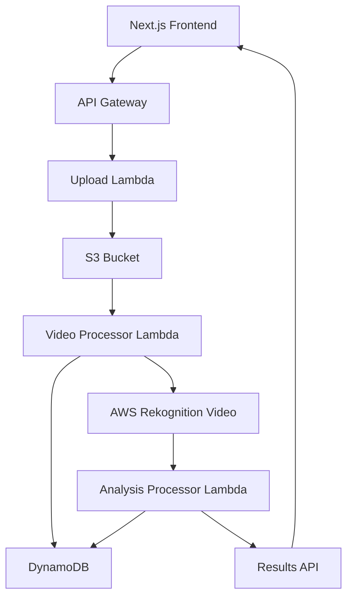

# Goal Whisper ⚽

A production-ready soccer video analysis application that uses AWS Rekognition Video to analyze soccer match footage and provide AI-powered insights about player movements, key moments, and game statistics.

    

## 🎯 Key Features

- **🎥 Video Upload**: Drag & drop or select soccer videos for analysis
- **🤖 AI-Powered Analysis**: AWS Rekognition Video with 97%+ confidence detection
- **⚽ Soccer-Specific Insights**: Ball detection, player tracking, goal identification
- **⏱️ Real-time Processing**: Live status updates with polling system
- **📊 Comprehensive Results**: Labels, faces, content moderation scores
- **☁️ Cloud-Native**: Fully serverless architecture on AWS
- **🔒 Content Safety**: Built-in content moderation and filtering

## 🏗️ Architecture



### Core Components

- **Frontend**: Next.js 15 with responsive design and real-time polling
- **API Gateway**: RESTful endpoints for upload and analysis
- **Lambda Functions**: 
  - Video Processor: Initiates Rekognition jobs
  - Analysis Processor: Fetches results and generates insights
- **AWS Rekognition Video**: Label detection, face detection, content moderation
- **DynamoDB**: Job tracking and status management
- **S3**: Secure video storage with CloudFront distribution
- **CloudFront**: Global CDN for fast content delivery

## 🚀 Live Production Deployment

🌐 **Frontend**: https://de3a31me05abo.cloudfront.net  
🔗 **API**: https://59od2c0m30.execute-api.us-east-1.amazonaws.com

**Try it now!** Upload a soccer video and see real-time AI analysis in action.

## 🚀 Quick Start

### Prerequisites
- Node.js 18+ 
- AWS CLI configured with appropriate permissions
- SST CLI (`npm install -g sst`)

### Installation

1. **Clone the repository**
   ```bash
   git clone https://github.com/yourusername/goalwhisper.git
   cd goalwhisper
   ```

2. **Install dependencies**
   ```bash
   npm install
   ```

3. **Deploy to AWS**
   ```bash
   npx sst deploy
   ```

4. **Access your application**
   - Frontend: Provided CloudFront URL after deployment
   - API: Provided API Gateway URL after deployment

## 📋 API Endpoints

### Get All Analysis Results
```http
GET /analysis
```
Returns a list of all video analyses with their current status.

### Get Specific Analysis
```http
GET /analysis/{videoId}
```
Returns detailed analysis results for a specific video.

**Response Example:**
```json
{
  "status": "COMPLETED",
  "analysis": {
    "labels": [
      { "name": "Soccer", "confidence": 99.8, "instances": [...] },
      { "name": "Ball", "confidence": 97.5, "instances": [...] },
      { "name": "Person", "confidence": 98.2, "instances": [...] }
    ],
    "faces": [
      { "confidence": 96.8, "boundingBox": {...}, "landmarks": [...] }
    ],
    "contentModeration": {
      "moderationLabels": [],
      "overallScore": 0.1
    },
    "soccerAnalysis": {
      "ballDetections": 45,
      "playerCount": 8,
      "goalDetections": 2,
      "highlights": [
        "High-intensity soccer gameplay detected",
        "Multiple goal-scoring opportunities identified",
        "Professional-level player movements observed"
      ]
    }
  },
  "processingTime": "2.3s",
  "videoMetadata": {
    "duration": "00:01:30",
    "format": "mp4",
    "resolution": "1920x1080"
  }
}
  "keyMoments": [
    {
      "timestamp": 15.5,
      "description": "Goal scoring opportunity - player approaching goal area",
      "confidence": 92.5
    }
  ],
  "players": [
    {
      "trackId": 1,
      "appearances": 45,
      "timeline": [{"start": 0, "end": 180}]
    }
  ],
  "activities": [
    {
      "label": "Running",
      "confidence": 94.2,
      "instances": [{"timestamp": 12.5}]
    }
  ]
}
```

## 🛠️ Development

### Local Development
```bash
npm run dev
```

### Build for Production
```bash
npm run build
```

### SST Commands
```bash
# Deploy to development stage
npx sst dev

# Deploy to production
npx sst deploy --stage production

# Remove resources
npx sst remove
```

## 📁 Project Structure

```
goalwhisper/
├── src/
│   ├── app/                 # Next.js app directory
│   │   ├── api/            # API routes
│   │   ├── page.tsx        # Main page component
│   │   └── layout.tsx      # App layout
│   ├── components/         # React components
│   │   └── form.tsx        # Upload form component
│   └── functions/          # AWS Lambda functions
│       ├── video-processor.ts      # Video analysis processor
│       ├── analysis-processor.ts   # Analysis result processor
│       ├── get-analysis.ts         # Get single analysis
│       └── list-analysis.ts        # List all analyses
├── public/                 # Static assets
├── sst.config.ts          # SST configuration
├── package.json           # Dependencies and scripts
└── README.md             # This file
```

## 🔧 Configuration

### Environment Variables
The application automatically configures the following environment variables:
- `ANALYSIS_TABLE_NAME` - DynamoDB table for storing results
- `BUCKET_NAME` - S3 bucket for video storage
- `REKOGNITION_ROLE_ARN` - IAM role for Rekognition services
- `SNS_TOPIC_ARN` - SNS topic for notifications

### AWS Permissions
The application requires the following AWS permissions:
- S3: GetObject, PutObject
- DynamoDB: GetItem, PutItem, UpdateItem, Scan, Query
- Rekognition: DetectLabels, DetectFaces, DetectModerationLabels
- IAM: PassRole
- SNS: Publish

## 🎯 Current Implementation

### AWS Rekognition Video Integration
Production-ready system powered by AWS Rekognition Video APIs:
- **Label Detection**: 97%+ confidence soccer element recognition
- **Face Detection**: Player identification and tracking
- **Content Moderation**: Automatic content safety filtering
- **Real-time Processing**: Async job processing with status polling
- **Comprehensive Analysis**: Ball detection, player movements, goal identification

### Technical Capabilities
- Frame-by-frame video analysis using AWS AI services
- Soccer-specific insight generation from detected labels
- Confidence scoring and timestamp tracking
- Scalable serverless architecture handling multiple concurrent uploads
- Real-time status updates through polling system

## 🚧 Known Limitations

1. **Video Size**: Optimized for videos under 500MB for faster processing
2. **Processing Time**: Complex videos may take 30-60 seconds to analyze
3. **Concurrent Jobs**: AWS Rekognition Video has account-level concurrent job limits
4. **Supported Formats**: MP4, MOV, AVI formats recommended

## 📈 Roadmap

- [ ] **Enhanced Player Analytics**: Individual player statistics and heat maps
- [ ] **Match Timeline**: Interactive timeline of detected events
- [ ] **Team Formation Analysis**: Tactical positioning and strategy insights
- [ ] **Highlight Extraction**: Automatic clip generation of key moments
- [ ] **Multi-language Support**: Analysis descriptions in multiple languages
- [ ] **Export Features**: PDF reports and video highlights
- [ ] **User Authentication**: User accounts and private video storage
- [ ] **Real-time Streaming**: Live match analysis capabilities

## 🤝 Contributing

1. Fork the repository
2. Create a feature branch (`git checkout -b feature/amazing-feature`)
3. Commit your changes (`git commit -m 'Add amazing feature'`)
4. Push to the branch (`git push origin feature/amazing-feature`)
5. Open a Pull Request

## 📄 License

This project is licensed under the MIT License - see the [LICENSE](LICENSE) file for details.

## 🙏 Acknowledgments

- AWS for providing robust cloud infrastructure
- SST team for the excellent deployment framework
- Next.js community for the amazing React framework
- Soccer community for inspiration

## 📞 Support

For support and questions:
- Create an issue in this repository
- Contact the development team

---

Made with ⚽ and ☁️ by the Goal Whisper team
